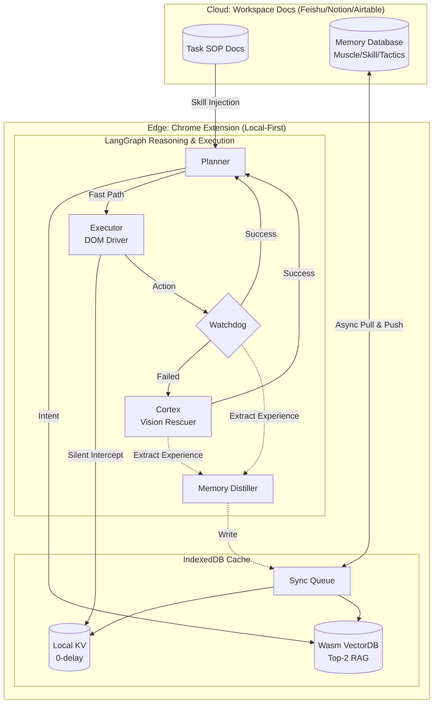

# 🤝 CoTabor.ai: The World's First Doc-Driven Digital Labor Force

> **文档即逻辑，Workspace 即大脑。让你的办公文档走出屏幕，化身为跨平台、能自进化的数字劳动力。**
> *Modular AI Co-worker powered by Midscene.js, LangGraph & Cloud-Edge Memory.*

**CoTabor** (Co-laborer + Tab) 是下一代**插件化（Pluggable）**数字协作引擎（Chrome 扩展形态）。
它打破了传统自动化工具“黑盒运行”与“难以维护”的瓶颈，首创 **“文档驱动逻辑（Doc-Driven Logic）”** 与 **“云边协同记忆（Cloud-Edge Memory）”**，让每一个业务员都能通过编写和阅读办公文档（如飞书多维表格、Notion、Airtable 等）来调教自己的 AI 合伙人。

---

## 🏗️ 核心支柱 (The Three Pillars)

### 1. 📄 文档即控制中枢与记忆实体 (Doc-Driven Hub)

* **零代码定义**：无需配置 JSON 或代码。Skill 的操作逻辑直接写在团队的 Workspace 中（当前支持飞书，陆续接入 Notion 等）。**修改文档即修改 AI 逻辑**，实现“业务标准即执行标准”。
* **记忆可视化可干预（Human-in-the-loop）**：AI 踩坑总结出的所有经验（如：某按钮怎么点、某 API 参数怎么传），全部存储为结构化的云端文档/表格。用户可随时增删改查，AI 的智商完全透明且可控。
* **团队级群体智能（Swarm Intelligence）**：组长在云端文档中定义一个任务或修改一条经验，全公司 3000 名员工的 CoTabor 瞬间习得该技能，实现一处踩坑，全员避坑。

### 2. 🧠 云边协同的三级记忆架构 (Cloud-Edge Tri-level Memory)

为了在“长上下文不爆炸”与“网页极速响应”之间取得完美平衡，CoTabor 独创了三层记忆隔离与云边同步架构：

* **L1 肌肉记忆层 (Muscle Memory)**：专治复杂的网页 DOM 交互。AI 遇到“假按钮”或“防爬虫遮罩”并尝试成功后，总结为微观物理规则。由 Executor **本地查表静默拦截**，对大模型完全隐身，0 Token 消耗。
* **L2 技能图谱层 (Skill Schema Memory)**：专治 API 参数报错。捕获参数修正历史，**动态拼接**到工具描述（Description）末尾。大模型按需阅读，避开接口陷阱。
* **L3 战术与偏好层 (Tactical & Preference Memory)**：专治长任务 SOP 和用户习惯。利用本地 WebAssembly 进行意图 RAG（向量检索），每次只注入最相关的 Top-2 宏观规则。
* **⚡ 云边流转机制**：用户的协同文档（如飞书/Notion）作为“云端持久化主库”，浏览器 `IndexedDB` 作为“端侧极速热缓存”。夜间/后台进行记忆“蒸馏”并批量上卷至云端，日间执行时只读本地缓存，实现零网络延迟。

### 3. 👁️ 阶梯式混合感知引擎 (Hybrid Perception Engine)

* **⚡️ 快通道：极速语义 (page-agent)**：利用轻量级脚本，毫秒级提取压缩 DOM 树。结合廉价纯文本大模型（如 Qwen-Plus），以极低的 Token 成本处理 90% 的日常规范网页。
* **👁️ 慢通道：视觉自愈 (Midscene Cortex)**：当 DOM 路径失效（如 Canvas、复杂 UI 或 Watchdog 报错），LangGraph 自动路由至视觉子图（Cortex）。调用多模态大模型（如 GPT-4o）进行全屏截图诊断与物理级坐标微操，抢救成功后自动提炼经验并降级回快通道。

---

## ⚙️ 系统架构 (System Architecture)

CoTabor 的“万物可插拔”内核将办公文档、本地记忆缓存与浏览器物理操作完美缝合：

---

## 🌟 核心产品特色 (Key Features)

### 🚀 1. 跨系统数据“破壁机”
无需对接各厂商昂贵且封闭的 API。基于用户已登录的浏览器标签页，CoTabor 能直接在亚马逊、淘宝、TikTok 的后台抓取报表，识别 Canvas 图表、表格翻页，并将多源数据汇总后直接写入飞书。

### 🛡️ 2. 极致的隐私与成本控制
* **隐私安全**：不用第三方 SaaS 记忆库（如 Mem0）。数据全部流转于用户自己的 Workspace（如飞书/Notion）与本地 IndexedDB 之间。
* **成本控制**：平时用便宜的文本模型（DOM），卡壳时才用昂贵的视觉模型（截图）；大模型提示词被极度压缩，杜绝上下文爆炸。

### 🕹️ 3. 工业级物理控制 (CDP Driver)
通过 Chrome Debugger Protocol 模拟真实物理轨迹（点击压力、随机偏移），完美避开高强度自动化监测，保护账号安全。

---

## 🎯 商业应用场景 (Business Scenarios)

* **数字化质检员**：跨境贸易中，根据云端文档中的《判定标准》自动巡检网页信息并录入结果。
* **虚拟数据分析师**：自动登录多个 SaaS 系统，提取零散数据并生成每日/每周汇总报告。
* **合规审计合伙人**：全天候监控特定页面变化，发现异常（如价格错误、库存预警）立即在协同文档中标记并通知。

---

## 🚀 发展路线图 (Roadmap)

### Phase 1: 认知内核与神经接通 (Current Focus)
* [x] **架构设计**：确立“快慢双通道分离”感知架构与“Workspace + IndexedDB 云边协同”三级记忆架构。
* [ ] **文档解析引擎**：完成从协同文档（首发飞书，后续 Notion）实时提取 Skill 指令集（Doc-to-Skill）的能力。
* [ ] **记忆缓存基建**：搭建基于 `IndexedDB` 和 `WebAssembly` 的本地热缓存与向量检索系统。

### Phase 2: 感知与执行闭环
* [ ] **混合感知调度**：实现基于 LangGraph 的 Planner -> Watchdog -> Cortex(Midscene) 的自动能级切换与错误抢救。
* [ ] **后台蒸馏器 (Memory Distiller)**：实现静默状态下的经验提炼与协同文档（Workspace Docs）的异步上卷。

### Phase 3: 劳动力扩散 (Scalability)
* [ ] **Skill 录制助手**：发布“演示即定义”模块，让非技术用户也能通过录屏生成 Skill。
* [ ] **企业级审计看板**：重构后台，支持大规模团队的并发任务监控与经验共享（群体智能）。

---

## 🤝 Contributing & License

CoTabor.ai 致力于将 AI 从“对话框”中解放出来，投入到真实的生产力现场。

MIT License © 2026 **CoTabor.ai** Team
