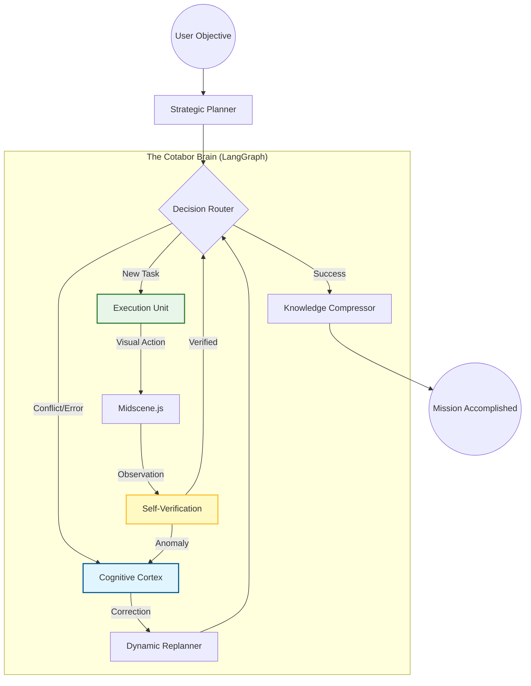

# 🤝 CoTabor.com: The Professional AI Co-laborer

> **协作、可靠、视觉优先。让每一个标签页都拥有一位“懂业务”的 AI 合伙人。**
> *Browser-Native AI Co-worker powered by Midscene.js & LangGraph.*

**CoTabor** (Co-laborer + Tab) 是浏览器原生的 AI 协作引擎。它跳出了传统自动化工具的局限，将 OpenClaw 的任务编排能力与浏览器的原生权限深度融合，旨在为你打造一个“开箱即用”的、具备专业素养的数字同事。

---

## 🏗️ 设计理念 (Design Philosophy)

CoTabor 的核心理念是 **“将浏览器从工具升级为协作空间”**：

* **⚡️ 零成本入职 (Zero-Config Deployment)**
无需复杂的 Python/Node 环境配置。像邀请同事加入项目一样简单：只需安装扩展，AI 即可在当前标签页“入职”并开始协作。
* **👁️ 视觉共情 (Vision-First Perception)**
采用 **Midscene.js** 作为感知内核。CoTabor 不像普通脚本那样“读代码”，而是像人类一样“看屏幕”。这赋予了它自适应网页变化的能力，实现真正的“视觉共鸣”。
* **🧠 职业逻辑 (Graph-Based Reasoning)**
引入 **LangGraph**。将复杂的协作任务拆解为“感知-规划-执行-反思”的图节点。CoTabor 不仅会干活，更具备自我修正和逻辑反思能力。
* **🖱️ 物理级稳健 (Professional Driver)**
通过 **Chrome Debugger Protocol (CDP)** 进行操作。模拟真实的点击压力与鼠标轨迹，以专业、拟人的方式与网页交互，绕过高强度自动化监测。

---

## 🧠 系统架构 (System Architecture)

CoTabor 采用 **LangGraph** 构建了一个具备“职业素养”的认知架构，确保任务的每一个步骤都经过严谨的思考与验证：

---

## 🌟 核心产品特色 (Key Features)

### 🧩 1. 技能导向的协作模式 (Skill-Based Coworking)

* **理念**：兼容 OpenClaw 的 `Action` 和 `Skill` 体系。
* **功能**：你可以为你的 Cotabor 定义特定的“专业技能包”（如：财务对账、数据分析、情报搜集）。AI 会像专业人士一样，根据目标自主调用最合适的技能。

### 🕹️ 2. 工业级执行标准

* **功能**：不再受限于脆弱的 JavaScript 模拟。通过 Debugger API，Cotabor 能够处理非标准 UI、多层 iframe 以及各种复杂的 Web 交互屏障。
* **优势**：在执行严肃的、具备防御机制的商业应用时，表现出极高的稳定性与专业度。

### 🎞️ 3. 协作回放与“工作日志”

* **功能**：集成可视化回放系统。
* **透明度**：记录 Cotabor 每一个决策点的视觉快照与思考逻辑。你可以随时查看“工作日志”，理解 AI 为什么这样做，并在必要时给予指导。

### 📡 4. 远程指令中继 (The Pinned Workspace)

* **功能**：通过常驻标签页监听 Notion/飞书/协作文档。
* **价值**：打破设备限制。在手机端修改协作文档，Cotabor 即可在远端浏览器内实时响应，完成你的委托。

---

## 🎯 协作场景 (Co-laboring Scenarios)

### 场景一：数字化办公搭档 (SaaS Coworker)

* **挑战**：多套 SaaS 系统（CRM、财务、OA）之间数据孤岛严重。
* **协作**：Cotabor 像同事一样，跨标签页同步信息。当你处理订单时，它自动在后台帮你完成发票校验与录入，实现无缝的工作流协同。

### 场景二：智能研报合伙人 (Insight Partner)

* **挑战**：信息过载，需要从数十个来源筛选并整合深度数据。
* **协作**：Cotabor 利用 LangGraph 的深度搜索节点，自主穿梭于各大专业站点，根据你的偏好抓取、对比并生成结构化洞察。

### 场景三：零维护的视觉质量专家 (UI Specialist)

* **挑战**：业务系统频繁更新，自动化脚本不断失效。
* **协作**：利用视觉感知的 Cotabor 只关心“业务目标”（如：点击审批）。即使 UI 布局大改，它也能凭借职业直觉准确定位，大幅降低维护成本。

---

## 🚀 发展路线图 (Roadmap)

### Phase 1: 建立连接 (Synchronization)

* [ ] **神经协议设计**：完成 `@cotabor/shared` 里的状态定义与动作契约。
* [ ] **视觉注入**：打通 Content Script 与 Midscene 运行时的实时快照通讯。
* [ ] **大脑原型**：在插件 Background 跑通首个基于 LangGraph 的“感知-反思”闭环。

### Phase 2: 专业进化 (Professional Mastery)

* [ ] **物理驱动优化**：完善拟人化点击算法，支持复杂的手势模拟。
* [ ] **长期记忆管理**：接入向量存储，让 Cotabor 记住你的操作偏好与历史场景。
* [ ] **协作仪表盘**：重构 Sidepanel，提供更具互动感的“协作任务看板”。

---

## 🤝 Contributing & License

Cotabor 欢迎每一位开发者加入，共同定义“数字劳动力”的未来。

MIT License © 2026 **CoTabor.ai** Team

