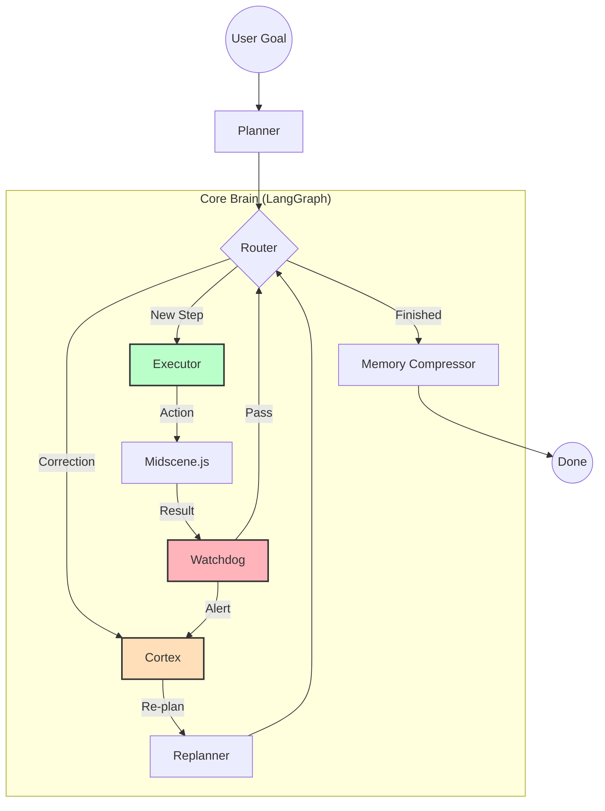

# 🦀 ChromeClaw: OpenClaw for Browser

> **极简、暴力、视觉优先。让每一个浏览器都拥有一只“大闸蟹”般的 AI 螯爪。**
>
> *Browser-Native AI Agent powered by Midscene.js & LangGraph.*

**ChromeClaw** 是 **OpenClaw** 的浏览器原生演进版本。它剥离了 OpenClaw 复杂的 Python 环境和 Playwright 依赖，直接利用浏览器插件的权限，实现了一套“开箱即用”的 AI Agent 架构。

---

## 🏗️ 设计理念 (Design Philosophy)

ChromeClaw 的核心理念是 **“让 AI 像人类一样操作浏览器”**：

*   **⚡️ 零配置安装 (Zero-Config)**
    不需要安装 Node/Python 环境，用户只需安装一个扩展程序，即可获得完整的 Agent 能力。
    
*   **👁️ 视觉驱动 (Vision-Driven)**
    采用 **Midscene.js** 作为视觉内核。AI 不读 DOM，而是看截图。这让它能自适应任何网页布局的变化，实现“一次编写，处处运行”。
    
*   **🧠 逻辑图化 (Graph-Based Reasoning)**
    引入 **LangGraph**。将自动化任务拆解为“感知-规划-执行-反思”的图节点，赋予大闸蟹处理复杂纠错和多分支逻辑的能力。
    
*   **🖱️ 物理级模拟 (Debugger-Powered)**
    通过 **Chrome Debugger Protocol (CDP)** 进行操作。模拟真实的鼠标轨迹和 Trusted Events，绕过 99% 的自动化监测。

---

## 🧠 系统架构 (System Architecture)

ChromeClaw 采用 **LangGraph** 构建了一个具备自我修正能力的认知架构：



---

## 🌟 核心产品特色 (Key Features)

### 🧩 1. OpenClaw 风格的技能系统
*   **理念**：完全继承 OpenClaw 的 `Action` 和 `Skill` 概念。
*   **功能**：用户可以通过简单的 JSON 或 TypeScript 定义“原子技能”（如：搜索、填表、抓取）。大闸蟹会自动根据任务目标进行技能编排。

### 🕹️ 2. 暴力且稳健的执行引擎
*   **功能**：不再受限于网页的 JavaScript 环境。通过 Debugger API，大闸蟹可以实现页面缩放、地理位置模拟、甚至是处理非标准 UI 组件。
*   **优势**：在执行复杂的、有防御机制的现代 Web 应用时，具有极高的成功率。

### 🎞️ 3. 影子回放与执行黑匣子
*   **功能**：集成 Midscene 的可视化报告系统。
*   **回放**：记录 AI 每一个决策点的视觉快照和思考逻辑。当 Agent 执行失败时，开发者可以像看电影回放一样定位问题，而不是去翻几万行的 Log。

### 📡 4. 轻量化远程指令中继
*   **功能**：利用常驻标签页（Pinned Tab）监听 Notion/飞书/腾讯文档。
*   **场景**：实现“文档驱动自动化”。你在任何终端（手机、Pad）修改云端文档的一行指令，大闸蟹就在后台静默完成任务。

---

## 🎯 通用用户场景 (General User Scenarios)

### 场景一：跨平台 SaaS 流程自动化
*   **痛点**：不同工具（如 CRM、ERP、协作软件）之间没有 API，或者 API 极其昂贵。
*   **方案**：大闸蟹同时感知多个标签页。自动从 CRM 抓取客户信息，并在财务系统中生成发票。无需编写爬虫，只需口语化指令：“把张三的本月订单同步到财务系统”。

### 场景二：智能 Web 调研与数据综合
*   **痛点**：需要打开几十个网页比价、查资料并整理。
*   **方案**：大闸蟹利用 LangGraph 的循环节点，自主在 Google、知乎、维基百科之间穿梭，抓取关键信息并生成一份综合报告。

### 场景三：无维护成本的 Web UI 测试
*   **痛点**：前端代码一变，自动化测试脚本就挂。
*   **方案**：利用 Midscene 的视觉感知，测试脚本只描述业务目标（如“点击购买按钮”）。即使按钮从蓝色变红色、位置从左移到右，大闸蟹依然能精准识别。

---

## 📂 项目工程目录 (Monorepo)

本项目采用 **pnpm + Turborepo** 进行管理，包含以下核心模块：

```text
chrome-claw/
├── apps/
│   └── extension/          # WXT 驱动的扩展主程序 (Background/Sidepanel/Content)
├── packages/
│   ├── core/               # LangGraph 驱动的任务调度大脑 (Cortex/Watchdog/Memory)
│   ├── vision/             # Midscene 封装的视觉感知适配器
│   ├── driver/             # Chrome CDP 物理执行驱动
│   └── shared/             # 通用通信协议与类型
├── turbo.json              # 构建流水线配置
└── pnpm-workspace.yaml     # 多包工作区管理
```

---

## 🚀 下一步开发计划 (Roadmap)

### Phase 1: 神经接通 (Wiring)
- [ ] **协议设计**：定义 `@claw/shared` 里的 Agent 状态和 Action 通信格式。
- [ ] **视觉接入**：实现 Content Script 对 Midscene Runtime 的注入与快照回传。
- [ ] **逻辑闭环**：在 Background 跑通第一个 LangGraph “感知-执行”循环。

### Phase 2: 核心增强 (Enhancement)
- [ ] **物理驱动**：完善 CDP 模拟，增加拟人化轨迹算法。
- [ ] **记忆系统**：实现基于 Vector Store 的长期记忆压缩。
- [ ] **回放面板**：开发可视化的调试回放 UI。

---

## 🤝 Contributing

欢迎提交 Issue 或 Pull Request。在贡献代码前，请确保遵循我们的 Monorepo 开发规范。

## 📄 License

MIT License © 2026 ChromeClaw Team
