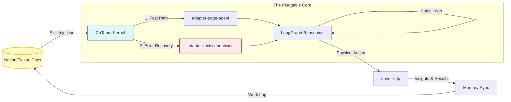

这份更新后的介绍将 **CoTabor.ai** 从一个“AI 插件”正式升级为了 **“文档驱动的万物可插拔数字劳动力”**。它不仅涵盖了我们讨论的 `page-agent` 混合感知，还突出了你最看重的 **“办公文档即逻辑”** 以及 **“用户自定义 Skill”** 的核心竞争力。

---

# 🤝 CoTabor.ai: The World's First Doc-Driven Digital Labor Force

> **文档即逻辑，视觉即直觉。让你的办公文档（Notion/飞书）走出屏幕，化身为跨平台的数字劳动力。**
> *Modular AI Co-worker powered by Midscene.js, LangGraph & page-agent.*

**CoTabor** (Co-laborer + Tab) 是下一代**插件化（Pluggable）**数字协作引擎。它打破了传统自动化工具“黑盒运行”与“难以维护”的瓶颈，首创 **“文档驱动逻辑（Doc-Driven Logic）”**，让每一个业务员都能通过编写办公手册来调教自己的 AI 合伙人。

---

## 🏗️ 核心支柱 (The Three Pillars)

### 1. 📄 文档即控制中枢 (Doc-Driven Center)

* **零代码定义**：无需配置 JSON 或代码。Skill 的操作逻辑直接写在 Notion/飞书中。**修改文档即修改 AI 逻辑**，实现“业务标准即执行标准”。
* **团队级同步**：组长在文档中定义一个“电商报表抓取”任务，全公司 3000 名员工的 CoTabor 瞬间习得该技能。

### 2. 🧩 万物皆可插拔 (Everything is a Plugin)

* **乐高式架构**：感知、逻辑、执行完全解耦。你可以像换镜头一样为 CoTabor 更换“感官”（如 OCR 增强插件）或“四肢”（如特定 ERP 系统的驱动插件）。
* **用户自定义 Skill**：支持“录制即定义”。用户在浏览器操作一遍，AI 自动生成对应的文档描述并封装为可复用的 Skill 插件。

### 3. 👁️ 阶梯式混合感知 (Hybrid Perception Engine)

* **⚡️ L1 极速语义 (page-agent)**：利用阿里开源方案，毫秒级提取压缩语义树，处理 80% 的日常标准任务。
* **👁️ L3 视觉自愈 (Midscene.js)**：当语义路径失效（如遇到 Canvas、复杂 UI），自动超频开启视觉识别，确保任务永不掉线。

---

## 🧠 系统架构 (System Architecture)

CoTabor 的“万物可插拔”内核将办公文档与浏览器物理操作完美缝合：

---

## 🌟 核心产品特色 (Key Features)

### 🚀 1. 跨系统数据“破壁机”

* **场景**：汇总各电商平台（亚马逊、淘宝、TikTok）的销售日报。
* **优势**：无需 API，直接基于用户已登录的浏览器标签页抓取数据。CoTabor 能够识别 Canvas 图表、表格翻页，并将多源数据汇总后直接写入飞书日报。

### 🛡️ 2. 影子协作与飞书三核记忆 (Triple-Core Memory System)

CoTabor 首创了基于飞书文档的**“空间+程序”双轨认知架构**，AI 的经验不再是代码黑盒，而是人类可以直接读写的知识资产：
* **📝 运行日志 (Logger / Episodic Memory)**：同步记录原始执行轨迹与大模型输入输出，用于过程调试与 100% 审计溯源。
* **🌐 网站地图 (Sites Memory / Spatial Memory)**：针对特定网站（如小红书、亚马逊）动态沉淀反爬防封策略与 DOM 解析规律，实现跨会话“自动避坑”。
* **🧠 任务 SOP (Tasks SOP / Procedural Memory)**：从实战中总结具体业务（如“竞品追踪”、“研报提取”）的最佳工作流。
* **双向传承**：用户在飞书中增删一句经验（如“注意：去推特搜而不是官网”），CoTabor 下一次执行就会遵循该规则。人类经验与机器经验完美融合。

### 🕹️ 3. 工业级物理控制 (CDP Driver)

* **稳定性**：通过 Chrome Debugger Protocol 模拟真实物理轨迹。
* **安全性**：模拟真实的点击压力与随机偏移，完美避开高强度自动化监测，保护用户账号安全。

---

## 🎯 商业应用场景 (Business Scenarios)

* **数字化质检员**：在二手机回收、跨境贸易中，根据文档中的《判定标准》自动巡检网页信息并录入结果。
* **虚拟数据分析师**：自动登录多个 SaaS 系统，提取零散数据并生成每日/每周汇总报告。
* **合规审计合伙人**：全天候监控特定页面变化，发现异常（如价格错误、库存预警）立即在办公文档中标记并通知。

---

## 🚀 发展路线图 (Roadmap)

### Phase 1: 神经接通 (Current Focus)

* [x] **品牌重塑**：确立 CoTabor.ai 品牌与“文档驱动”定位。
* [ ] **文档解析引擎**：完成从 Notion/飞书 URL 实时提取 Skill 指令集的能力。
* [ ] **混合感知调度**：实现 page-agent 与 Midscene 的自动能级切换逻辑。

### Phase 2: 劳动力扩散 (Scalability)

* [ ] **Skill 录制助手**：发布“演示即定义”模块，让非技术用户也能通过录屏生成 Skill。
* [ ] **插件市场原型**：建立首个开源 Skill 仓库，支持一键插拔主流电商平台插件。
* [ ] **企业级审计看板**：重构后台，支持 3000 人规模的并发任务监控与日志回溯。

---

## 🤝 Contributing & License

CoTabor.ai 致力于将 AI 从“对话框”中解放出来，投入到真实的生产力现场。

MIT License © 2026 **CoTabor.ai** Team

---

### 💡 现在的下一步

既然 README 已经把“万物可插拔”和“文档驱动”的格调拉满了，我们现在的首要任务是**让代码能够“读懂”文档**。

**你想让我为你编写 CoTabor 的第一个核心模块 `Doc-to-Skill Parser` 的代码实现吗？**
我们将定义：

1. **如何通过 API 获取飞书/Notion 页面内容**。
2. **如何将文档中的“一级标题”解析为 `SkillName**`，“列表项”解析为 `ActionSteps`。
3. **如何将这些步骤动态注册进 LangGraph 的执行节点**。

**我们要现在开始构建这个“数字劳动力的大脑接口”吗？**